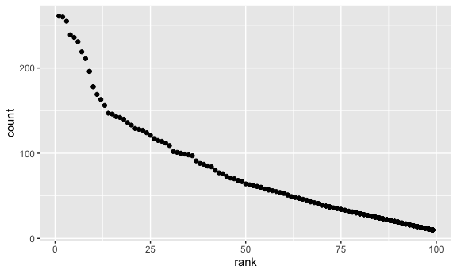

P8105\_HomeWork2\_qc2307
================
Qixiang Chen
10/9/2021

``` r
library(tidyverse)
```

    ## ── Attaching packages ─────────────────────────────────────── tidyverse 1.3.1 ──

    ## ✓ ggplot2 3.3.5     ✓ purrr   0.3.4
    ## ✓ tibble  3.1.4     ✓ dplyr   1.0.7
    ## ✓ tidyr   1.1.3     ✓ stringr 1.4.0
    ## ✓ readr   2.0.1     ✓ forcats 0.5.1

    ## ── Conflicts ────────────────────────────────────────── tidyverse_conflicts() ──
    ## x dplyr::filter() masks stats::filter()
    ## x dplyr::lag()    masks stats::lag()

``` r
library(readxl)
```

## Question 1

This problem uses the Mr. Trash Wheel dataset, available as an Excel
file on the course website.

Read and clean the Mr. Trash Wheel sheet:

specify the sheet in the Excel file and to omit non-data entries (rows
with notes / figures; columns containing notes) using arguments in
read\_excel use reasonable variable names omit rows that do not include
dumpster-specific data round the number of sports balls to the nearest
integer Read and clean precipitation data for 2018 and 2019. For each,
omit rows without precipitation data and add a variable for year. Next,
combine precipitation datasets and convert month to a character variable
(the variable month.name is built into R and should be useful).

Write a paragraph about these data; you are encouraged to use inline R.
Be sure to note the number of observations in both resulting datasets,
and give examples of key variables. For available data, what was the
total precipitation in 2018? What was the median number of sports balls
in a dumpster in 2019?

``` r
wheel_data_raw = read_excel("./data/Trash-Wheel-Collection-Totals-7-2020-2.xlsx", sheet = 1)
```

    ## New names:
    ## * `` -> ...15
    ## * `` -> ...16
    ## * `` -> ...17

``` r
wheel_clean_name = janitor::clean_names(wheel_data_raw)
wheel_data_selected = drop_na(wheel_clean_name, dumpster)
wheel_data_rounded = mutate(wheel_data_selected, sports_balls = round(sports_balls))
wheel_data_cleaned = drop_na(wheel_data_rounded, date)
wheel_data_cleaned
```

    ## # A tibble: 453 × 17
    ##    dumpster month  year date                weight_tons volume_cubic_yards
    ##    <chr>    <chr> <dbl> <dttm>                    <dbl>              <dbl>
    ##  1 1        May    2014 2014-05-16 00:00:00        4.31                 18
    ##  2 2        May    2014 2014-05-16 00:00:00        2.74                 13
    ##  3 3        May    2014 2014-05-16 00:00:00        3.45                 15
    ##  4 4        May    2014 2014-05-17 00:00:00        3.1                  15
    ##  5 5        May    2014 2014-05-17 00:00:00        4.06                 18
    ##  6 6        May    2014 2014-05-20 00:00:00        2.71                 13
    ##  7 7        May    2014 2014-05-21 00:00:00        1.91                  8
    ##  8 8        May    2014 2014-05-28 00:00:00        3.7                  16
    ##  9 9        June   2014 2014-06-05 00:00:00        2.52                 14
    ## 10 10       June   2014 2014-06-11 00:00:00        3.76                 18
    ## # … with 443 more rows, and 11 more variables: plastic_bottles <dbl>,
    ## #   polystyrene <dbl>, cigarette_butts <dbl>, glass_bottles <dbl>,
    ## #   grocery_bags <dbl>, chip_bags <dbl>, sports_balls <dbl>,
    ## #   homes_powered <dbl>, x15 <chr>, x16 <lgl>, x17 <lgl>

``` r
wheel_clean_row = nrow(wheel_data_cleaned)
wheel_clean_row
```

    ## [1] 453

``` r
wheel_clean_col = ncol(wheel_data_cleaned)
wheel_clean_col
```

    ## [1] 17

``` r
precipitation_data_raw_2018 = read_excel("./data/Trash-Wheel-Collection-Totals-7-2020-2.xlsx", sheet = 7, range =  "A2:B14")
precipitation_data_raw_2019 = read_excel("./data/Trash-Wheel-Collection-Totals-7-2020-2.xlsx", sheet = 6, range = "A2:B14")
precipitation_clean_name_2018 = janitor::clean_names(precipitation_data_raw_2018)
precipitation_clean_name_2019 = janitor::clean_names(precipitation_data_raw_2019)
precipitation_2018_dropNA = drop_na(precipitation_clean_name_2018, total)
precipitation_2019_dropNA = drop_na(precipitation_clean_name_2019, total)
precipitation_2018 = mutate(
  precipitation_2018_dropNA,
  year = 2018,
  month = month.name[month],
)
precipitation_2018 = relocate(precipitation_2018, year)
precipitation_2019 = mutate(
  precipitation_2019_dropNA,
  year = 2019,
  month = month.name[month],
)
precipitation_2019 = relocate(precipitation_2019, year)
precipitation_2018
```

    ## # A tibble: 12 × 3
    ##     year month     total
    ##    <dbl> <chr>     <dbl>
    ##  1  2018 January    0.94
    ##  2  2018 February   4.8 
    ##  3  2018 March      2.69
    ##  4  2018 April      4.69
    ##  5  2018 May        9.27
    ##  6  2018 June       4.77
    ##  7  2018 July      10.2 
    ##  8  2018 August     6.45
    ##  9  2018 September 10.5 
    ## 10  2018 October    2.12
    ## 11  2018 November   7.82
    ## 12  2018 December   6.11

``` r
precipitation_2019
```

    ## # A tibble: 12 × 3
    ##     year month     total
    ##    <dbl> <chr>     <dbl>
    ##  1  2019 January    3.1 
    ##  2  2019 February   3.64
    ##  3  2019 March      4.47
    ##  4  2019 April      1.46
    ##  5  2019 May        3.58
    ##  6  2019 June       0.42
    ##  7  2019 July       3.85
    ##  8  2019 August     2.39
    ##  9  2019 September  0.16
    ## 10  2019 October    5.45
    ## 11  2019 November   1.86
    ## 12  2019 December   3.57

``` r
combined_2018_2019 = rbind(precipitation_2018, precipitation_2019)
combined_2018_2019_relocated = relocate(combined_2018_2019, year)
combined_2018_2019_relocated
```

    ## # A tibble: 24 × 3
    ##     year month     total
    ##    <dbl> <chr>     <dbl>
    ##  1  2018 January    0.94
    ##  2  2018 February   4.8 
    ##  3  2018 March      2.69
    ##  4  2018 April      4.69
    ##  5  2018 May        9.27
    ##  6  2018 June       4.77
    ##  7  2018 July      10.2 
    ##  8  2018 August     6.45
    ##  9  2018 September 10.5 
    ## 10  2018 October    2.12
    ## # … with 14 more rows

``` r
combined_2018_2019_row = nrow(combined_2018_2019_relocated)
combined_2018_2019_col = ncol(combined_2018_2019_relocated)
```

(write a short paragraph about this dataset): The dataset
`wheel_data_cleaned` is generated after doing data clean and rounding
`sports_balls` variable. In the dataset wheel\_data\_rounded, there are
453 rows and 17 columns. The precipitation dataset
`combined_2018_2019_relocated` is generated through combining the
precipitation data sheet of 2018 and the precipitation data sheet of
2019. In the dataset, there are 24 rows and 3 columns. The total
precipitation in 2018 is 70.33. The median precipitation in 2019 is 9.

## Question 2

This problem uses the FiveThirtyEight data; these data were gathered to
create the interactive graphic on this page. In particular, we’ll use
the data in pols-month.csv, unemployment.csv, and snp.csv. Our goal is
to merge these into a single data frame using year and month as keys
across datasets.

First, clean the data in pols-month.csv. Use separate() to break up the
variable mon into integer variables year, month, and day; replace month
number with month name; create a president variable taking values gop
and dem, and remove prez\_dem and prez\_gop; and remove the day
variable.

Second, clean the data in snp.csv using a similar process to the above.
For consistency across datasets, arrange according to year and month,
and organize so that year and month are the leading columns.

Third, tidy the unemployment data so that it can be merged with the
previous datasets. This process will involve switching from “wide” to
“long” format; ensuring that key variables have the same name; and
ensuring that key variables take the same values.

Join the datasets by merging snp into pols, and merging unemployment
into the result.

Write a short paragraph about these datasets. Explain briefly what each
dataset contained, and describe the resulting dataset (e.g. give the
dimension, range of years, and names of key variables).

Note: we could have used a date variable as a key instead of creating
year and month keys; doing so would help with some kinds of plotting,
and be a more accurate representation of the data. Date formats are
tricky, though. For more information check out the lubridate package in
the tidyverse.

``` r
#First
pols_month_df =
  read_csv("./data/fivethirtyeight_datasets/pols-month.csv") %>%
  janitor::clean_names() %>%
  separate(mon, into = c("year", "month_day_2"), sep =  4) %>%
  separate(month_day_2, into = c("first_underscore", "month_day_1"), sep = 1) %>%
  separate(month_day_1, into = c("month", "day_1"), sep = 2) %>%
  separate(day_1, into = c("second_underscore", "day"), sep = 1) %>%
  select(-first_underscore) %>%
  select(-second_underscore) %>%
  mutate(
    year = as.numeric(year),
    month = month.name[as.numeric(month)],
    president = prez_gop - prez_dem,
    president = recode_factor(president, `1` = "gop", `2` = "gop", `-1` = "dem"),
  ) %>%
  select(-prez_gop) %>%
  select(-prez_dem) %>%
  relocate(year, month, president) %>%
  select(-day)
```

    ## Rows: 822 Columns: 9

    ## ── Column specification ────────────────────────────────────────────────────────
    ## Delimiter: ","
    ## dbl  (8): prez_gop, gov_gop, sen_gop, rep_gop, prez_dem, gov_dem, sen_dem, r...
    ## date (1): mon

    ## 
    ## ℹ Use `spec()` to retrieve the full column specification for this data.
    ## ℹ Specify the column types or set `show_col_types = FALSE` to quiet this message.

``` r
pols_month_df
```

    ## # A tibble: 822 × 9
    ##     year month     president gov_gop sen_gop rep_gop gov_dem sen_dem rep_dem
    ##    <dbl> <chr>     <fct>       <dbl>   <dbl>   <dbl>   <dbl>   <dbl>   <dbl>
    ##  1  1947 January   dem            23      51     253      23      45     198
    ##  2  1947 February  dem            23      51     253      23      45     198
    ##  3  1947 March     dem            23      51     253      23      45     198
    ##  4  1947 April     dem            23      51     253      23      45     198
    ##  5  1947 May       dem            23      51     253      23      45     198
    ##  6  1947 June      dem            23      51     253      23      45     198
    ##  7  1947 July      dem            23      51     253      23      45     198
    ##  8  1947 August    dem            23      51     253      23      45     198
    ##  9  1947 September dem            23      51     253      23      45     198
    ## 10  1947 October   dem            23      51     253      23      45     198
    ## # … with 812 more rows

``` r
#Second
snp_data_df = 
  read_csv("./data/fivethirtyeight_datasets/snp.csv") %>%
  janitor::clean_names() %>%
  separate(date, into = c("month", "day", "year"), sep = "/") %>%
  mutate(
    month = month.name[as.numeric(month)],
    day = as.numeric(day),
    year = as.numeric(year),
    year = case_when(year > 20 ~ year + 1900,
                     year <= 20 ~ year +2000),
  ) %>%
  relocate(year, month, day) %>%
  select(-day)
```

    ## Rows: 787 Columns: 2

    ## ── Column specification ────────────────────────────────────────────────────────
    ## Delimiter: ","
    ## chr (1): date
    ## dbl (1): close

    ## 
    ## ℹ Use `spec()` to retrieve the full column specification for this data.
    ## ℹ Specify the column types or set `show_col_types = FALSE` to quiet this message.

``` r
snp_data_df  
```

    ## # A tibble: 787 × 3
    ##     year month    close
    ##    <dbl> <chr>    <dbl>
    ##  1  2015 July     2080.
    ##  2  2015 June     2063.
    ##  3  2015 May      2107.
    ##  4  2015 April    2086.
    ##  5  2015 March    2068.
    ##  6  2015 February 2104.
    ##  7  2015 January  1995.
    ##  8  2014 December 2059.
    ##  9  2014 November 2068.
    ## 10  2014 October  2018.
    ## # … with 777 more rows

``` r
#Third
unemployment_df = 
  read_csv("./data/fivethirtyeight_datasets/unemployment.csv") %>%
  janitor::clean_names() %>%
  pivot_longer(
    jan:dec,
    names_to = "month",
    values_to = "unemployment_rate",
  ) %>%
    mutate(month = recode(month, 
                          "jan" = "January",
                          "feb" = "February",
                          "mar" = "March",
                          "apr" = "April",
                          "may" = "May",
                          "jun" = "June",
                          "jul" = "July",
                          "aug" = "August",
                          "sep" = "September",
                          "oct" = "October",
                          "nov" = "November",
                          "dec" = "December"
                          ))
```

    ## Rows: 68 Columns: 13

    ## ── Column specification ────────────────────────────────────────────────────────
    ## Delimiter: ","
    ## dbl (13): Year, Jan, Feb, Mar, Apr, May, Jun, Jul, Aug, Sep, Oct, Nov, Dec

    ## 
    ## ℹ Use `spec()` to retrieve the full column specification for this data.
    ## ℹ Specify the column types or set `show_col_types = FALSE` to quiet this message.

``` r
unemployment_df  
```

    ## # A tibble: 816 × 3
    ##     year month     unemployment_rate
    ##    <dbl> <chr>                 <dbl>
    ##  1  1948 January                 3.4
    ##  2  1948 February                3.8
    ##  3  1948 March                   4  
    ##  4  1948 April                   3.9
    ##  5  1948 May                     3.5
    ##  6  1948 June                    3.6
    ##  7  1948 July                    3.6
    ##  8  1948 August                  3.9
    ##  9  1948 September               3.8
    ## 10  1948 October                 3.7
    ## # … with 806 more rows

``` r
#Merging
result1 = left_join(pols_month_df, snp_data_df)
```

    ## Joining, by = c("year", "month")

``` r
pols_snp_unemployment = left_join(result1, unemployment_df)
```

    ## Joining, by = c("year", "month")

``` r
pols_snp_unemployment = relocate(pols_snp_unemployment, year, month, president, close, unemployment_rate)
pols_snp_unemployment = arrange(pols_snp_unemployment, desc(year))
pols_snp_unemployment
```

    ## # A tibble: 822 × 11
    ##     year month    president close unemployment_ra… gov_gop sen_gop rep_gop gov_dem
    ##    <dbl> <chr>    <fct>     <dbl>            <dbl>   <dbl>   <dbl>   <dbl>   <dbl>
    ##  1  2015 January  dem       1995.              5.7      31      54     245      18
    ##  2  2015 February dem       2104.              5.5      31      54     245      18
    ##  3  2015 March    dem       2068.              5.5      31      54     245      18
    ##  4  2015 April    dem       2086.              5.4      31      54     244      18
    ##  5  2015 May      dem       2107.              5.5      31      54     245      18
    ##  6  2015 June     dem       2063.              5.3      31      54     246      18
    ##  7  2014 January  dem       1783.              6.6      29      45     232      21
    ##  8  2014 February dem       1859.              6.7      29      45     232      21
    ##  9  2014 March    dem       1872.              6.6      29      45     233      21
    ## 10  2014 April    dem       1884.              6.2      29      45     233      21
    ## # … with 812 more rows, and 2 more variables: sen_dem <dbl>, rep_dem <dbl>

(write a short paragraph about this dataset): After reading in and
cleaning the data, for the dataset `pols_month_df`, there are 822 rows
and 9 columns. The data from year 1947 to year 2015 are included. The
key variables include `precident`, `gov_gop`, `gov_dem`, `sen_gop`,
`sen_dem`, `rep_gop`, and `rep_dem`. For the `snp_data_df` dataset,
there are 787 rows and 3 columns. The data from year 1950 to year 2015
are included. Further, the key variable include `close`. For the
`unemployment_df` dataset, there are 816 rows and 3 columns. The data
from year 1948 to year 2015 are included. The key variable is
`unemployment_rate`. Then, after combining the datasets,
`pols_snp_unemployment` dataset is generated. there are 822 rows and 11
columns. The data from year 1947 to year 2015 are included. The key
variables include `precident`, `gov_gop`, `gov_dem`, `sen_gop`,
`sen_dem`, `rep_gop`, `rep_dem`, `close`, and `unemployment_rate`.

## Qestion 3

This problem uses data from NYC Open data on the popularity of baby
names, and can be downloaded here.

Load and tidy the data. Note that, although these data may seem fairly
well formatted initially, the names of a categorical predictor and the
case structure of string variables changed over time; you’ll need to
address this in your data cleaning. Also, some rows seem duplicated, and
these will need to be removed (hint: google something like “dplyr remove
duplicate rows” to get started).

Produce a well-structured, reader-friendly table showing the rank in
popularity of the name “Olivia” as a female baby name over time; this
should have rows for ethnicities and columns for year. Produce a similar
table showing the most popular name among male children over time.

Finally, for male, white non-hispanic children born in 2016, produce a
scatter plot showing the number of children with a name (y axis) against
the rank in popularity of that name (x axis).

``` r
# Step_1:clean data;
baby_name_df = 
  read_csv("./data/Popular_Baby_Names.csv") %>%
  janitor::clean_names() %>%
  mutate(ethnicity = recode(ethnicity,
                            "ASIAN AND PACI" = "ASIAN AND PACIFIC ISLANDER",
                            "BLACK NON HISP" = "BLACK NON HISPANIC",
                            "WHITE NON HISP" = "WHITE NON HISPANIC")) %>%
mutate(childs_first_name = plu::capitalize(tolower(childs_first_name))) %>%
  distinct() %>%
  arrange(rank)
```

    ## Rows: 19418 Columns: 6

    ## ── Column specification ────────────────────────────────────────────────────────
    ## Delimiter: ","
    ## chr (3): Gender, Ethnicity, Child's First Name
    ## dbl (3): Year of Birth, Count, Rank

    ## 
    ## ℹ Use `spec()` to retrieve the full column specification for this data.
    ## ℹ Specify the column types or set `show_col_types = FALSE` to quiet this message.

``` r
baby_name_df
```

    ## # A tibble: 12,181 × 6
    ##    year_of_birth gender ethnicity                  childs_first_name count  rank
    ##            <dbl> <chr>  <chr>                      <chr>             <dbl> <dbl>
    ##  1          2016 FEMALE ASIAN AND PACIFIC ISLANDER Olivia              172     1
    ##  2          2016 FEMALE BLACK NON HISPANIC         Ava                 109     1
    ##  3          2016 FEMALE HISPANIC                   Isabella            276     1
    ##  4          2016 FEMALE WHITE NON HISPANIC         Olivia              230     1
    ##  5          2016 MALE   ASIAN AND PACIFIC ISLANDER Ethan               193     1
    ##  6          2016 MALE   BLACK NON HISPANIC         Noah                148     1
    ##  7          2016 MALE   HISPANIC                   Liam                387     1
    ##  8          2016 MALE   WHITE NON HISPANIC         Joseph              261     1
    ##  9          2015 FEMALE ASIAN AND PACIFIC ISLANDER Olivia              188     1
    ## 10          2015 FEMALE BLACK NON HISPANIC         Madison             128     1
    ## # … with 12,171 more rows

``` r
# Step_2:Produce a well-structured, reader-friendly table containing rows for ethnicities and columns for year, and showing the rank in popularity of the name “Olivia” as a female baby name over time;
baby_female_name = 
  baby_name_df %>%
  filter(gender == "FEMALE", childs_first_name == "Olivia") %>%
  select(year_of_birth, ethnicity, rank, gender) %>%
  pivot_wider(
    names_from = "year_of_birth",
    values_from = "rank",
  )
baby_female_name
```

    ## # A tibble: 4 × 8
    ##   ethnicity                  gender `2016` `2015` `2014` `2013` `2011` `2012`
    ##   <chr>                      <chr>   <dbl>  <dbl>  <dbl>  <dbl>  <dbl>  <dbl>
    ## 1 ASIAN AND PACIFIC ISLANDER FEMALE      1      1      1      3      4      3
    ## 2 WHITE NON HISPANIC         FEMALE      1      1      1      1      2      4
    ## 3 BLACK NON HISPANIC         FEMALE      8      4      8      6     10      8
    ## 4 HISPANIC                   FEMALE     13     16     16     22     18     22

``` r
# Step_3:Similar table as above for male baby;
baby_male_name = 
  baby_name_df %>%
  filter(gender == "MALE", rank == 1) %>%
  select(year_of_birth, ethnicity, childs_first_name, rank) %>%
  pivot_wider(
    names_from = "year_of_birth",
    values_from = "rank",
  ) %>%
  arrange(ethnicity)
baby_male_name
```

    ## # A tibble: 11 × 8
    ##    ethnicity          childs_first_na… `2016` `2015` `2014` `2013` `2012` `2011`
    ##    <chr>              <chr>             <dbl>  <dbl>  <dbl>  <dbl>  <dbl>  <dbl>
    ##  1 ASIAN AND PACIFIC… Ethan                 1     NA     NA     NA     NA      1
    ##  2 ASIAN AND PACIFIC… Jayden               NA      1      1      1     NA     NA
    ##  3 ASIAN AND PACIFIC… Ryan                 NA     NA     NA     NA      1     NA
    ##  4 BLACK NON HISPANIC Noah                  1      1     NA     NA     NA     NA
    ##  5 BLACK NON HISPANIC Ethan                NA     NA      1      1     NA     NA
    ##  6 BLACK NON HISPANIC Jayden               NA     NA     NA     NA      1      1
    ##  7 HISPANIC           Liam                  1      1      1     NA     NA     NA
    ##  8 HISPANIC           Jayden               NA     NA     NA      1      1      1
    ##  9 WHITE NON HISPANIC Joseph                1     NA      1     NA      1     NA
    ## 10 WHITE NON HISPANIC David                NA      1     NA      1     NA     NA
    ## 11 WHITE NON HISPANIC Michael              NA     NA     NA     NA     NA      1

``` r
# Step_4:For male, white non-hispanic children born in 2016, produce a scatter plot showing the number of children with a name (y axis) against the rank in popularity of that name (x axis);
baby_male_name_2016 = 
  baby_name_df %>%
  filter(year_of_birth == 2016, ethnicity == "WHITE NON HISPANIC", gender == "MALE") %>%
  ggplot(aes(x = rank, y = count)) + geom_point()
baby_male_name_2016
```


